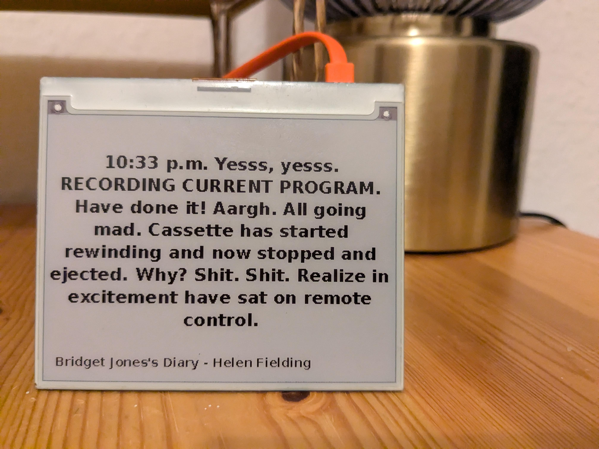

# Literature Clock – InkyWHAT

Displays a literary quote for every minute of the day on a Pimoroni InkyWHAT e-ink screen. The time within the quote is always highlighted in **red**; the surrounding text is black.



## How it works

- At startup all 1 440 per-minute JSON files (stored in `docs/times/`) are loaded into memory.
- Every minute a random quote for the current time is selected and rendered on the display.
- The quote is split into three parts — text before the time, the time itself, and text after the time — so the time can be drawn in a different colour.
- Font size is chosen by quote length and automatically reduced in steps of 2 pt until the entire quote fits on screen.
- Title and author are shown in small text at the bottom.

## Requirements

**Hardware**
- Raspberry Pi (any model with 40-pin GPIO)
- Pimoroni InkyWHAT – red/black/white variant

**Software**
- Raspberry Pi OS (Bookworm or later)
- Python 3
- [Pillow](https://python-pillow.org/)
- [inky](https://github.com/pimoroni/inky) library
- DejaVu fonts (`fonts-dejavu-core` package)

## Installation

### 1 – Enable SPI and I2C

```
sudo raspi-config
```
Go to **Interface Options** and enable both **SPI** and **I2C**, then reboot.

Or edit `/boot/firmware/config.txt` directly:

```ini
dtparam=spi=on
dtparam=i2c_arm=on
```

### 2 – Install dependencies

```bash
sudo apt-get install -y python3-pip python3-pil fonts-dejavu-core
pip3 install inky==1.5.0 --break-system-packages
```

### 3 – Clone the repository

```bash
git clone https://github.com/YOUR_USERNAME/literature-clock_inkywhat.git /home/YOUR_USERNAME/literature-clock_inkywhat
```

### 4 – Set up the systemd service

```bash
sudo cp /home/YOUR_USERNAME/literature-clock_inkywhat/literature-clock.service /etc/systemd/system/
sudo systemctl daemon-reload
sudo systemctl enable --now literature-clock
```

The service file includes `ExecStartPre=/sbin/modprobe i2c-dev` which ensures the I2C kernel module is loaded before the script starts — required for the InkyWHAT to initialise correctly.

### 5 – Check it is running

```bash
systemctl status literature-clock
journalctl -u literature-clock -f
```

## Usage

Run directly (for testing):

```bash
cd /home/YOUR_USERNAME/literature-clock_inkywhat
python3 quote_display.py
```

Pass a fixed time for testing a specific minute:

```python
QuoteDisplay(fixedTime='13_37')
```

## Project structure

```
literature-clock_inkywhat/
├── quote_display.py          # Main script
├── literature-clock.service  # systemd service file
├── docs/
│   ├── times/                # 1 440 JSON files (one per minute)
│   └── index.html            # Web preview of all quotes
└── looks/
    └── inky_what_clock.jpeg  # Photo of the display
```

## Based on the work of

- [JohannesNE](https://github.com/JohannesNE)
- [tafj0](https://github.com/tafj0)
- [Jaap Meijers](http://www.eerlijkemedia.nl/) – original idea ([E-reader clock](https://www.instructables.com/id/Literary-Clock-Made-From-E-reader/))
